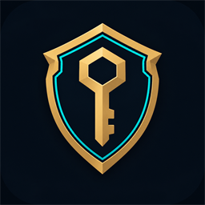

<p align="center"></p>

# Smurf Vault

Bóveda cifrada para tus cuentas de Riot (LoL), con respaldo en tu Google Drive.

- 🔐 **Todo cifrado** con tu contraseña maestra (scrypt + AES-256-GCM). Nada sale de tu PC sin cifrar.
- ☁️ **Respaldo en Google Drive**: la bóveda se guarda en una carpeta oculta de *tu* Drive y se sincroniza entre PCs.
- 🎮 **Detectar cliente**: con el LoL abierto, lee nick, tag, nivel, ícono, rangos de LoL y TFT y la última partida de la cuenta en la que iniciaste sesión.
- 🕒 **Última partida** de cada cuenta (LoL o TFT), para ordenarlas por las que usas más.
- 📈 **Actualizar rangos** de todas las cuentas sin abrir el juego (API oficial de Riot, necesita una API key gratuita).
- ⚡ **Autoaceptar partidas** (opcional, en Herramientas).
- 📋 Copiar usuario y contraseña con un clic; el portapapeles se limpia a los 30 s.
- 📥 **Importar** tu txt viejo (`usuario:contraseña` por línea).
- 🔄 **Se actualiza sola** cuando sale una versión nueva (versión instalada).

## Instalar
1. Descarga `Smurf-Vault-Setup-x.y.z.exe` desde [Releases](https://github.com/tobaalhs/smurf-vault/releases)
   (o la versión *Portable* si no quieres instalar nada).
2. Windows puede mostrar **"Windows protegió tu PC"** porque el instalador no está firmado:
   **Más información → Ejecutar de todas formas**.
3. Crea tu contraseña maestra. **No se puede recuperar**: si la olvidas, pierdes la bóveda.

### Sincronizar con Google Drive
⚙ **Ajustes → Vincular cuenta de Google**, inicia sesión con tu Gmail y **marca la casilla de Drive** cuando
Google te pida permisos. Google puede avisar que la app "no está verificada": **Configuración avanzada → Ir a
Smurf Vault**. Tu bóveda se guarda cifrada en una carpeta oculta de *tu* Drive; nadie más tiene acceso.

### API key de Riot (opcional)
Para "Actualizar rangos": entra a https://developer.riotgames.com, copia la **Development API Key**
(dura 24 h) o pide una **Personal API Key** (no caduca). La app te la pide la primera vez que la usas.

## Desarrollo
```bash
npm install
npm start        # abre la app
npm test         # pruebas
npm run dist     # genera el instalador y la versión portable en dist/
```

- `main.js`: proceso principal (bóveda en memoria, IPC, sincronización).
- `src/vault.js`: cifrado · `src/drive.js`: OAuth de Google + Drive `appDataFolder`.
- `src/lcu.js`: API local del cliente de LoL · `src/autoaccept.js`: autoaceptar.
- `src/riot.js`: API oficial de Riot · `renderer/`: interfaz.

## Publicar una versión
1. Sube la versión en `package.json` (por ejemplo `0.2.0`) y haz commit.
2. Crea y sube el tag: `git tag v0.2.0` y `git push origin v0.2.0`.
3. GitHub Actions compila el instalador y publica la release; las apps instaladas se actualizan solas.

Las credenciales de Google se toman del secreto `GOOGLE_CREDENTIALS` del repo (Settings → Secrets and
variables → Actions), con el contenido completo de `credentials.json`. Nunca van en el código.

Para compilar tu propia versión (o regenerar las credenciales) necesitas un Client ID de Google propio:
sigue [docs/GOOGLE_SETUP.md](docs/GOOGLE_SETUP.md) y deja el `credentials.json` en la raíz del proyecto.

## Aviso legal
Smurf Vault isn't endorsed by Riot Games and doesn't reflect the views or opinions of Riot Games or anyone
officially involved in producing or managing Riot Games properties. Riot Games, and all associated properties
are trademarks or registered trademarks of Riot Games, Inc.

Licencia [MIT](LICENSE).
